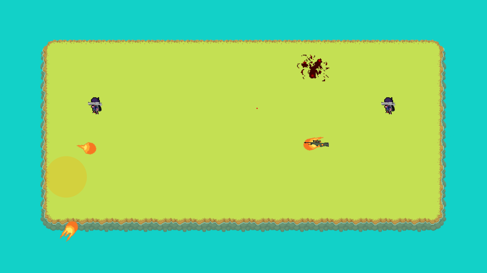

# Island Knockout

## Description
Island Knockout est un projet de jeu développé en Java, utilisant les bibliothèques JavaFX pour l'interface utilisateur et FXGL pour les fonctionnalités spécifiques au développement de jeux. Le projet inclut également la prise en charge de la manette via JInput et XInput Plugin for JInput.

Ce guide détaille comment configurer, compiler et exécuter le projet en utilisant Maven.

## Prérequis

Avant de commencer, assurez-vous que les éléments suivants sont installés sur votre système :

* Java Development Kit (JDK) version 21 ou supérieure.
  ```bash
  java -version
  ```

* Apache Maven version 3.6 ou supérieure.
  ```bash
  mvn -version
  ```

* Git (optionnel) pour cloner le projet depuis un dépôt.

## Installation

### Étapes

1. Clonez ou téléchargez le projet :
   ```bash
   git clone https://github.com/EpitechMscProPromo2027/T-JAV-501-NAN_2.git
   cd Dual_Arena
   ```

2. Vérifiez que Maven peut télécharger les dépendances :
   ```bash
   mvn dependency:resolve
   ```

3. Compilez le projet :
   ```bash
   mvn clean install
   ```

4. Pour exécuter le projet avec la commande Maven :
   ```bash
   mvn javafx:run
   ```

## Configuration

### Dépendances utilisées

Le fichier `pom.xml` inclut les dépendances suivantes :

* FXGL (v21.1) : Framework pour les jeux Java
* JavaFX (v21) : Framework pour l'interface utilisateur
* JInput (v2.0.10) et XInput Plugin : Gestion des entrées des manettes
* JUnit 5 (v5.10.2) : Framework de tests

Ces dépendances sont automatiquement téléchargées lors de l'exécution de `mvn install`.

### Répertoires importants

* `src/main/java` : Contient le code source principal du projet
* `src/test/java` : Contient les tests unitaires
* `target/` : Dossier de sortie pour les fichiers compilés

### Compatibilité des manettes

Les fichiers natifs nécessaires pour la prise en charge des manettes sont gérés par le plugin `maven-nativedependencies-plugin`. Assurez-vous que le chemin des bibliothèques natives est correctement configuré.

## Exécution et Compilation

### Exécution via Maven

Pour lancer directement le jeu depuis Maven :
```bash
mvn javafx:run
```

### Compilation manuelle

Si vous souhaitez compiler et exécuter manuellement :

1. Compilez le projet :
   ```bash
   mvn clean compile
   ```

2. Exécutez le fichier JAR généré :
   ```bash
   java -jar target/Dual_Arena-1.0-SNAPSHOT.jar
   ```

## Tests

Pour exécuter les tests unitaires :
```bash
mvn test
```

## Résolution des problèmes

1. **Erreur de version Java** : Assurez-vous que votre version de JDK est 21 ou supérieure.
   ```bash
   sudo update-alternatives --config java
   ```

2. **Dépendances non téléchargées** : Si Maven ne télécharge pas correctement les dépendances :
   ```bash
   mvn dependency:purge-local-repository
   ```

3. **Problème de manette** : Vérifiez que les bibliothèques natives sont correctement extraites dans le dossier `target/natives`.

## Contribution

Si vous souhaitez contribuer :

1. Forkez le dépôt
2. Créez une branche pour votre modification :
   ```bash
   git checkout -b feature/ma-modification
   ```
3. Proposez une pull request après vos modifications

## Auteur

* [LeoPartt](https://github.com/LeoPartt) LeoPartt
* [Jauresacs](https://github.com/Jauresacs) Jaures Acs
* [Frimolin](https://github.com/Frimolin) Parisel Guillaume

## Licence

Ce projet est sous licence libre.
